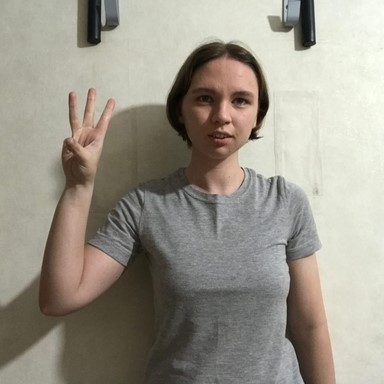

# Hand Gesture Detector WebGL Demo
 A hand gesture detector made with TensorFlow.js and Unity

## In-Browser Demo

|  Demo Link      |
| ------------------------------------------------------------ |
| [Hand Gesture Detector](https://cj-mills.github.io/hand-gesture-detector-webgl-demo/) |

<h2>Reference Images</h2>
 

| Class    | Image                                              |
| --------- | ------------------------------------------------------------ |
| call    |  |
| dislike         |  |
| fist    |  |
| four         |  |
| like         |  |
| mute         |  |
| ok    |  |
| one         |  |
| palm         |  |
| peace         |  |
| peace_inverted         |  |
| rock         |  |
| stop         |  |
| stop_inverted         |  |
| three         |  |
| three2         |  |
| two_up         |  |
| two_up_inverted         |  |

## Tutorial Links
